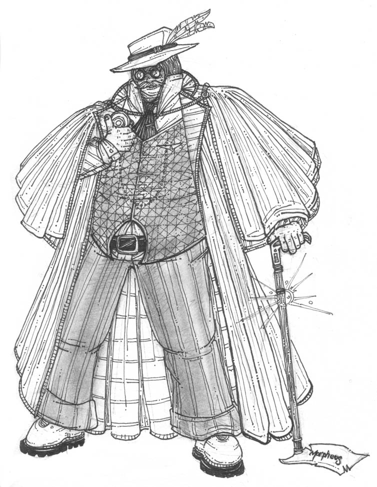

# Coz Crosser (Pathfinder)

Itinerant preacher and ~~servant of the Church of Sarenrae~~ bringer of the **true** light of Sarenrae.

*"By the Sun we see the world clearly; the BUZZING LIES of the drone bees, from the churches, the thrones, the pages of books, trouble us not! They are vanished in the holy singing of the MYSTIC CUBE, the SUN that you feel on your eyes! I will tell you this again and some of you will not believe me; the din of the BUZZING LIES is too great. But if you are ready to be a MIRROR OF JOY and RIGHTEOUSNESS, you only need to look into the sky and REFLECT what you see! The HORNET-DRAGONS of Cheliax and the forces of MENTAL SLAVERY have no power to stay the FREE-MINDED, the GENEROUS-SOULED, and the PATIENT!"*

  * **Level**: 1
  * **Race**: Human
  * **Class**: Paladin
  * **Alignment**: Lawful Good

*A mountainlike brown-skinned man in a worn honey-colored suit. Various pink and green tunics are stuffed haphazardly into his belt. In his right hand is a gentlemanly cane, the crook of which is fashioned into a face (whose, you cannot tell). The man looks weather-worn; someone who's been traveling a long time. His squat head, like the cherry on top of a pudding, nods constantly in agreement with himself as he scans the people in the room. Noticing you, he gives a long and steady smile. His face is wrinkled and somehow lopsided, but his teeth are stunningly white.*

(Sort of like this, but not quite).

| Ability Score | Starting Value | Bonuses/Penalties  |  Total  | Modifier |
| ------------- |:--------------:| ------------------:|--------:|---------:|
| Str           | 14             | -                  | 14      | **+2**   |
| Dex           | 9              | -                  | 9       | **-1**   |
| Con           | 16             | -                  | 16      | **+3**   |
| Int           | 10             | -                  | 10      | **+0**   |
| Wis           | 7              | -                  | 7       | **-2**   |
| Cha           | 16             | +2 (Human)         | 18      | **+4**   |

**Feats**: [**Power Attack**](http://www.d20pfsrd.com/feats/combat-feats/power-attack-combat---final), [**Improved Initiative**](http://www.d20pfsrd.com/feats/combat-feats/improved-initiative-combat---final)
      
**Trained Skills**:

| Skill                        | Ranks         | Bonuses/Penalties            |  Ability| Modifier |
| ----------------------------:|--------------:| ----------------------------:|--------:|---------:|
| Diplomacy *(Cha)*            | 1             | +3 (class skill)             | +4      | **+8**   |
| Bluff *(Cha)*                | 1             | +3 (class skill) +1 (trait)  | +4      | **+9**   |
| Knowledge (religion) *(Int)* | 1             | +3 (class skill)             | +0      | **+4**   |

**Traits**: [**Inspired**](http://www.d20pfsrd.com/traits/faith-traits/inspired), [**Unpredictable**](http://www.d20pfsrd.com/traits/social-traits/unpredictable), [**Posessed**](http://www.d20pfsrd.com/traits/magic-traits/possessed)

**Drawbacks**: [**Headstrong**](http://www.d20pfsrd.com/traits/drawbacks/headstrong)

**Possessions (on person)**: Sword cane, holy symbol, three sunrods.

**Possessions (stashed away)**: Heavy wooden shield, scale mail, longsword (and scabbard), greatsword (and scabbard).

The following have no mechanical effect; they're just a character-building idea stolen from Unknown Armies. Rage is what enrages Coz, Fear is what makes him afraid, Obsession is what he can't stop thinking about, Noble is what inspires him to selflessness.

  * **Rage**: When he believes that complacency & failure to "get it" have caused widespread harm. 
  * **Fear**: Coz is absolutely terrified of being mind-controlled; even the threat of it reduces him to a gibbering wreck. He is less severely terrified of being tricked or duped into believing something that isn't true (and overcompensates accordingly).
  * **Obsession**: A complex conspiracy theory, spanning countries, which involves his former associates at the Church of Sarenrae in Magnimar. Verges on the metaphysical, changes daily as Coz believes he is getting closer to the truth.
  * **Noble**: Like the Dr. Bronner of our world, Coz loves the idea of unifying all the world under his philosophy. Less loftily, banding together with others to defeat (what he sees as) an oppressive force inspires in him great effort and bravery.
